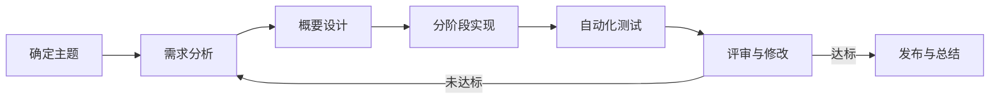

# 课程设计初步实验计划

本计划对应 Word 文档中实验 1 的第 5 项任务“安排软件工程课程设计流程，撰写初步的实验计划”。其中明确列出个人学习目标和时间分配，不另设“个人职责分配”内容。

## 一、课程设计主题

**个人任务管理系统（Personal Task Manager）**

面向个人学习、课程作业和日常事务，提供任务创建、状态跟踪、优先级管理、截止日期、标签筛选和完成情况统计等能力。首个版本以完成可运行的最小功能集为目标。

## 二、个人学习目标

1. 熟悉 Python、Git、IDE、自动化测试和 Markdown/Mermaid 等工具的基本使用。
2. 掌握 Git 提交、远程仓库和版本追踪方法，保持实验过程可回溯。
3. 了解从需求分析、设计、实现、测试到总结的软件工程基本流程。
4. 能够为功能编写可验证的验收条件和自动化测试。
5. 提高实验报告、项目说明和过程记录的组织能力。

## 三、课程设计流程

每个阶段都形成可检查的产物，并在提交前运行已有测试；后续阶段的文档和代码以 Git 提交记录关联。

## 四、时间分配（初步安排）

计划周期为 8 周，总投入约 40 小时。时间可根据课程进度调整，但每周保留可运行、可验证的阶段成果。

| 周次 | 主要任务 | 阶段成果 | 预计时间 |
|---|---|---|---:|
| 第 1 周 | 环境搭建、选题、仓库和实验计划 | 实验 1 成果、项目计划 | 4 小时 |
| 第 2 周 | 用户场景、功能/非功能需求、验收条件 | 需求规格说明书初稿 | 5 小时 |
| 第 3 周 | 页面原型、数据模型、系统结构和接口 | 设计说明书 | 5 小时 |
| 第 4 周 | 任务增删改查、数据持久化 | 核心功能版本 | 6 小时 |
| 第 5 周 | 状态、优先级、截止日期和筛选 | 可用版本 | 6 小时 |
| 第 6 周 | 单元测试、接口测试和异常处理 | 测试用例与报告 | 5 小时 |
| 第 7 周 | 界面完善、扩展功能和缺陷修复 | 候选发布版本 | 5 小时 |
| 第 8 周 | 回归测试、部署说明、演示和总结 | 最终版本与课程报告 | 4 小时 |
|  | **合计** |  | **40 小时** |

## 五、工具与记录方式

- 编程语言：Python；
- 版本控制：Git + GitHub；
- 编辑器：Visual Studio Code；
- 测试：Python `unittest`；
- 建模与文档：Mermaid + Markdown。

代码、测试、实验报告和计划文件统一放在实验仓库中；每个阶段完成后创建一次目标单一的 Git 提交。

## 六、实验 1 完成情况与后续安排

- [x] 安装并验证编程工具、Git、IDE 和文档/建模工具；
- [x] 注册 GitHub 账号并创建实验仓库；
- [x] 编写、运行和测试 Hello World 程序并提交；
- [x] 阅读课程第一章节对应内容，确定个人任务管理系统主题；
- [x] 完成个人学习目标和时间分配；
- [ ] 根据选题开展实验 2 需求调研并撰写需求规格说明书。
