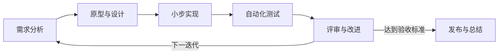

# 课程设计初步实验计划

## 一、项目主题

**个人任务管理系统（Personal Task Manager）**

面向需要管理学习、课程作业和日常事务的个人用户，提供简单、清晰、可追踪的任务管理能力。项目以完成一个最小可用产品为目标，强调软件工程全过程，而不是堆叠功能。

## 二、项目目标

1. 支持任务的创建、查看、修改和删除。
2. 支持待办、进行中、已完成三种状态及状态切换。
3. 支持优先级、截止日期、标签和关键词检索。
4. 保存任务数据，并提供基本统计信息。
5. 建立需求、设计、实现、测试和发布文档，使开发过程可追溯。

## 三、范围定义

### 核心范围（必须完成）

- 创建、编辑、删除和查看任务；
- 任务状态、优先级和截止日期管理；
- 条件筛选与关键词搜索；
- 本地持久化存储；
- 输入校验、异常提示和自动化测试；
- README、需求说明、设计说明与测试报告。

### 扩展范围（时间允许时完成）

- 到期提醒；
- 标签统计和完成率图表；
- 数据导入与导出；
- 深色模式或响应式界面。

### 暂不纳入

- 多人实时协作；
- 在线支付；
- 复杂权限系统；
- 原生移动端应用。

## 四、开发流程

采用“迭代增量 + 测试驱动”的轻量流程：

每周至少形成一个可运行增量；每项功能通过分支或独立提交完成，提交前运行测试。

## 五、技术路线

| 层次 | 初步选择 | 选择理由 |
|---|---|---|
| 编程语言 | Python | 语法清晰、便于测试与快速迭代 |
| 用户界面 | Flask + HTML/CSS（计划） | 适合小型 Web 应用，学习成本可控 |
| 数据存储 | SQLite | 无需独立服务器，支持结构化查询 |
| 测试 | unittest / pytest | 覆盖单元与接口行为 |
| 版本管理 | Git + GitHub | 支持过程追踪与远程备份 |
| 建模与文档 | Mermaid + Markdown | 可与源代码一起进行版本控制 |

技术选型将在需求评审后确认；若课程限定其他语言或框架，保持需求和测试目标不变，仅替换实现技术。

## 六、里程碑与时间分配

计划周期为 8 周，总投入约 40 小时。

| 周次 | 阶段 | 主要任务 | 交付物 | 预计时间 |
|---|---|---|---|---:|
| 第 1 周 | 准备 | 环境搭建、选题、仓库与计划 | 实验 1 成果、项目计划 | 4 小时 |
| 第 2 周 | 需求 | 用户场景、功能/非功能需求、验收条件 | 需求规格说明书 | 5 小时 |
| 第 3 周 | 设计 | 页面原型、数据模型、系统结构、接口 | 原型与设计说明书 | 5 小时 |
| 第 4 周 | 迭代 1 | 任务增删改查、数据持久化 | 核心功能版本 | 6 小时 |
| 第 5 周 | 迭代 2 | 状态、优先级、截止日期、筛选 | 可用版本 | 6 小时 |
| 第 6 周 | 质量 | 单元测试、接口测试、异常处理 | 测试用例与测试报告 | 5 小时 |
| 第 7 周 | 完善 | UI 改进、扩展功能、缺陷修复 | 候选发布版本 | 5 小时 |
| 第 8 周 | 验收 | 回归测试、部署说明、演示与总结 | 最终版本与课程报告 | 4 小时 |
|  |  | **合计** |  | **40 小时** |

## 七、个人职责分配

本项目按个人项目执行，一人承担全部角色。为了避免角色遗漏，按职责分配时间：

| 角色 | 主要职责 | 时间占比 | 约合时间 |
|---|---|---:|---:|
| 产品/需求 | 调研场景、确定范围、编写验收标准 | 15% | 6 小时 |
| 设计 | 原型、数据模型、架构与接口设计 | 15% | 6 小时 |
| 开发 | 编码、数据库与界面实现 | 40% | 16 小时 |
| 测试 | 测试设计、执行、缺陷跟踪 | 20% | 8 小时 |
| 配置与文档 | Git 管理、发布、报告与演示材料 | 10% | 4 小时 |
| **合计** |  | **100%** | **40 小时** |

## 八、验收标准

1. 所有核心范围功能可在干净环境中运行。
2. 核心业务自动化测试全部通过，无阻断性缺陷。
3. 非法输入不会导致程序崩溃，并给出清晰提示。
4. README 能让新用户在 10 分钟内完成安装与首次运行。
5. Git 提交能够对应需求、实现、测试和修复过程。
6. 需求、设计、测试和总结文档完整且相互一致。

## 九、风险与应对

| 风险 | 可能影响 | 应对措施 |
|---|---|---|
| 功能范围持续扩大 | 核心功能延期 | 固定核心范围，扩展功能仅在核心验收后开发 |
| 新框架学习耗时 | 开发进度下降 | 先完成命令行/最小 Web 原型，再逐步优化界面 |
| 测试安排过晚 | 缺陷集中出现 | 每个迭代同步编写测试并持续回归 |
| 数据结构频繁变化 | 返工与数据不兼容 | 第 3 周评审数据模型，变更时记录迁移方案 |
| 单人任务中断 | 里程碑延误 | 任务拆分到 1～2 小时粒度，每周预留缓冲时间 |

## 十、第一阶段待办

- [x] 验证 Python、Git 和 IDE 环境
- [x] 建立实验仓库
- [x] 编写并测试 Hello World
- [x] 确定课程设计主题
- [x] 制定初步计划与时间分配
- [x] 创建 GitHub 远程仓库并上传实验成果
- [ ] 编写正式需求规格说明书
